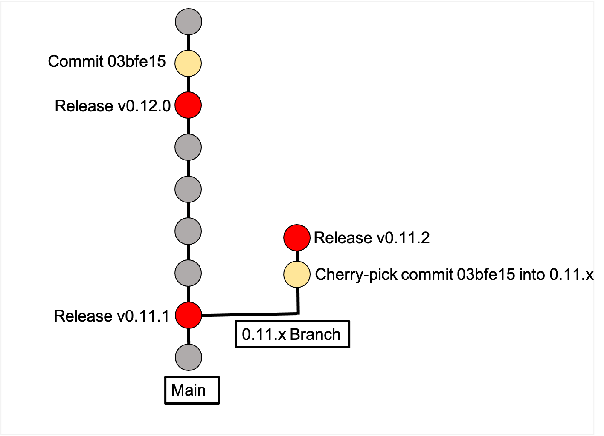

# Backport Release Process

In situations where we need to backport commits to earlier versions of our software, we'll need to perform the release process slightly differently than a normal release.

<p align="center">

</p>

This document outlines the differences between a normal release and a backport release. It uses the same outline as the [Release Guide](../release.md).

## 0. Pre-Release Checklist

Before starting the backport release process, verify the following:

- Get agreement on the latest commit to use for targeting the release. A backport release will be targeted on some commit other than the latest on main. Many times the new target will be an old release, which will have a tag that can be referenced--for example `v0.11.1`.
- Get agreement on the commits to port over for the backport release.
- Get agreement on the version number to use for the backport release.

#### Version Numbering for Backport Releases

Featuretools uses [semantic versioning](https://semver.org/). Every release has a major, minor and patch version number, and are displayed like so: `<majorVersion>.<minorVersion>.<patchVersion>`. **A backport release will increment the patch version.**

This may be an intermediate number between two preexisting releases--for example a new `0.11.2` to be added between existing `0.11.1` and `0.12.0` releases. It can also be a new latest release--so `0.12.1` in the same situation--using only some of the commits that are present in the Future Release section of the release notes.

## 0.5. Create target branch for backport release

#### Checkout intended target commit

1. Checkout the agreed upon latest commit for targeting the release. If this is a previous release, you may checkout its tag with `git checkout v0.11.1`.

#### Create backport branch

1. Branch off of the target commit. For the branch name, please use the most recent major and minor versions to this commit (in this example `0` and `11` respectively), leaving the patch number as an `x`. This means that we would create `0.11.x` in the working example. This is necessary so that if any further backport releases are needed, we could continue to use this branch as the target. This branch is to be treated as `main` is treated in a normal release. It will be the target for our release.

This branch will be automatically protected (unless the version exceeds 9.Y.x or X.99.x, in which case contact the repo team about expanding the protection rules) to avoid unintended commits from making their way into the release undetected.

#### Port over desired commits

1. Create a feature branch off the backport branch. For the branch name, please use "backport_vX.Y.Z" as the naming scheme (e.g. "backport_v0.11.2). Doing so will bypass our release notes checkin test which requires all other PRs to add a release note entry.
2. Cherry-pick the desired commits onto `backport_v0.11.2`.
3. Create a pull request with the backport `0.11.x` branch as its target, get confirmation that the desired changes were added, and confirm that the CI checks pass.
4. Under the "Future Release" section in the release notes, include the ported over commits' release notes (don't remove them from their original location back on `main`), indicating that they are a backport of the original PR.

   ```
   Future Release
   ==============
       * Enhancements
       * Fixes
           * Fix bug (backport of :pr:`1110`)
       * Changes
       * Documentation Changes
       * Testing Changes

   Thanks to the following people for contributing to this release:
   ```

5. Merge the PR into the `0.11.x` backport branch

## 1. Create Featuretools Backport release on Github

With our backport branch `0.11.x` as our target, we now proceed with the release of `0.11.2`.

#### Create release branch

1. **Branch off of the backport branch `0.11.x`.** For the branch name, please use "release_vX.Y.Z" as the naming scheme (e.g. "release_v0.11.2"). Doing so will bypass our release notes checkin test which requires all other PRs to add a release note entry.

#### Bump version number

1. Bump `__version__` in `setup.py`, `featuretools/version.py`, and `featuretools/tests/test_version.py`.

#### Update Release Notes

1. Replace **"Future Release"** in `docs/source/release_notes.rst` with the current date

   ```
   v0.11.2 Sep 28, 2020
   ====================
   ```

2. Remove any unused Release Notes sections for this release (e.g. Fixes, Testing Changes)
3. Add yourself to the list of contributors to this release and **put the contributors in alphabetical order**
4. The release PR does not need to be mentioned in the list of changes
5. Add a commented out "Future Release" section with all of the Release Notes sections above the current section

   ```
   .. Future Release
     ==============
       * Enhancements
       * Fixes
       * Changes
       * Documentation Changes
       * Testing Changes

   .. Thanks to the following people for contributing to this release:
   ```

#### Create Release PR

A [release pr](https://github.com/alteryx/featuretools/pull/1915) should have the version number as the title and the release notes for that release as the PR body text. The contributors list is not necessary. The special sphinx docs syntax (:pr:\`547\`) needs to be changed to github link syntax (#547).

Checklist before merging:

- All tests are currently green on checkin and on `0.11.x`.
- The ReadtheDocs build for the release PR branch has passed, and the resulting docs contain the expected release notes.
- PR has been reviewed and approved.
- Confirm with the team that `0.11.x` will be frozen until step 2 (Github Release) is complete.

## 2. Create Github Release

After the release pull request has been merged into the `0.11.x` branch, it is time draft the github release. [Example release](https://github.com/alteryx/featuretools/releases/tag/v1.6.0)

- **The target should be the `0.11.x` backport branch**
- The tag should be the version number with a v prefix (e.g. v0.11.2)
- Release title is the same as the tag
- Release description should be the full Release Notes updates for the release, including the line thanking contributors. Contributors should also have their links changed from the docs syntax (:user:\`gsheni\`) to github syntax (@gsheni)
- This is not a pre-release
- Publishing the release will automatically upload the package to PyPI

Note that this backported release will show up on the repository's front page as the latest release even if there is technically a later `0.12.0` release.

## Release on conda-forge

If a later release exists, conda-forge will not automatically create a new PR in [conda-forge/featuretools-feedstock](https://github.com/conda-forge/featuretools-feedstock/pulls). Instead a PR will need to be manually created. You can do either of the following:

- Branch off of the 0.11.1 meta.yaml update commit for the 0.11.2 meta.yaml changes. This is "cleaner" and sometimes easier, but if migration files (like py310) have been added between 0.11.1 and 0.12.0 you will have to add them in and re-render yourself.
- Tack the 0.11.2 changes on after the 0.12.0 update commit in the feedstock repo. This means that if any of the boilerplate has changed, you do not have to manually re-add it yourself. An example of this can be seen from a Woodwork backport release [here](https://github.com/conda-forge/woodwork-feedstock/pull/32).

Once the PR is created:

1. Update requirements changes in `recipe/meta.yaml` - you may need to handle the version, source links, and SHA256 if you had to open the PR yourself. You will also need to update the requirements.
2. After tests pass, a maintainer will merge the PR in
