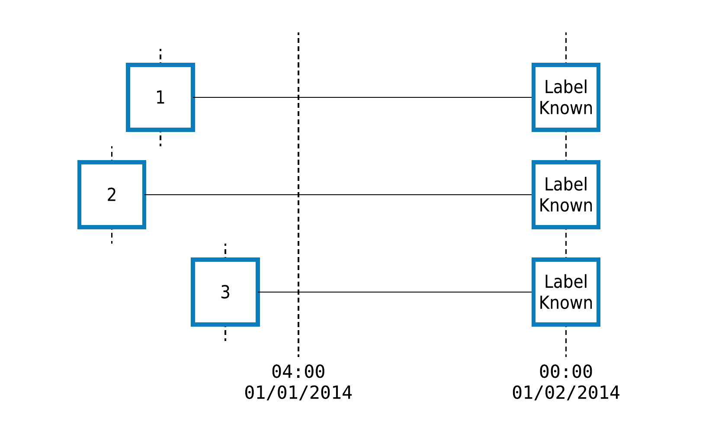
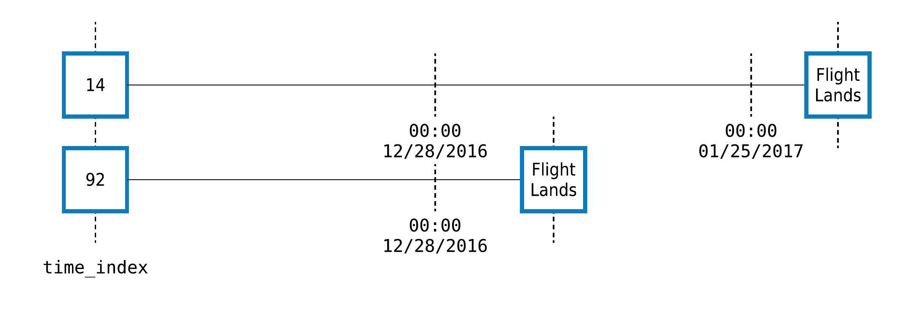

.. _handling-time:

.. currentmodule:: featuretools

Handling Time
=============

When performing feature engineering with temporal data, carefully selecting the data that is used for any calculation is paramount. By annotating :term:`entities <entity>` with a **time index** column and providing a **cutoff time** during feature calculation, Featuretools will automatically filter out any data after the cutoff time before running any calculations.

What is the Time Index?
-----------------------

The time index is the column in the data that specifies when the data in each row became known. For example, let's examine a table of customer transactions:

.. ipython:: python
    :suppress:

    pd.options.display.max_columns = 200

.. ipython:: python

    import featuretools as ft
    es = ft.demo.load_mock_customer(return_entityset=True, random_seed=0)
    es['transactions'].df.head()

In this table, there is one row for every transaction and a ``transaction_time`` column that specifies when the transaction took place. This means that ``transaction_time`` is the time index because it indicates when the information in each row became known and available for feature calculations.

However, not every datetime column is a time index. Consider the ``customers`` entity:

.. ipython:: python

    es['customers'].df

Here, we have two time columns, ``join_date`` and ``date_of_birth``. While either column might be useful for making features, the ``join_date`` should be used as the time index because it indicates when that customer first became available in the dataset.

.. important::

    The **time index** is defined as the first time that any information from a row can be used. If a cutoff time is specified when calculating features, rows that have a later value for the time index are automatically ignored.

.. _cutoff-time:

What is the Cutoff Time?
------------------------
The **cutoff_time** specifies the last point in time that a row’s data can be used for a feature calculation. Any data after this point in time will be filtered out before calculating features.

For example, let's consider a dataset of timestamped customer transactions, where we want to predict whether customers ``1``, ``2`` and ``3`` will spend $500 between ``04:00`` on January 1 and the end of the day. When building features for this prediction problem, we need to ensure that no data after ``04:00`` is used in our calculations.

We pass the cutoff time to :func:`featuretools.dfs` or :func:`featuretools.calculate_feature_matrix` using the ``cutoff_time`` argument like this:

.. ipython:: python

    fm, features = ft.dfs(entityset=es,
                          target_entity='customers',
                          cutoff_time=pd.Timestamp("2014-1-1 04:00"),
                          instance_ids=[1,2,3],
                          cutoff_time_in_index=True)
    fm

Even though the entityset contains the complete transaction history for each customer, only data with a time index up to and including the cutoff time was used to calculate the features above.

Using a Cutoff Time DataFrame
~~~~~~~~~~~~~~~~~~~~~~~~~~~~~

Oftentimes, the training examples for machine learning will come from different points in time. To specify a unique cutoff time for each row of the resulting feature matrix, we can pass a dataframe which includes one column for the instance id and another column for the corresponding cutoff time. These columns can be in any order, but they must be named properly. The column with the instance ids must either be named ``instance_id`` or have the same name as the target entity ``index``. The column with the cutoff time values must either be named ``time`` or have the same name as the target entity ``time_index``.

The column names for the instance ids and the cutoff time values should be unambiguous. Passing a dataframe that contains both a column with the same name as the target entity ``index`` and a column named ``instance_id`` will result in an error. Similarly, if the cutoff time dataframe contains both a column with the same name as the target entity ``time_index`` and a column named ``time`` an error will be raised.

.. note::

    Only the columns corresponding to the instance ids and the cutoff times are used to calculate features. Any additional columns passed through are appended to the resulting feature matrix. This is typically used to pass through machine learning labels to ensure that they stay aligned with the feature matrix.

.. ipython:: python

    cutoff_times = pd.DataFrame()
    cutoff_times['customer_id'] = [1, 2, 3, 1]
    cutoff_times['time'] = pd.to_datetime(['2014-1-1 04:00',
                                 '2014-1-1 05:00',
                                 '2014-1-1 06:00',
                                 '2014-1-1 08:00'])
    cutoff_times['label'] = [True, True, False, True]
    cutoff_times
    fm, features = ft.dfs(entityset=es,
                          target_entity='customers',
                          cutoff_time=cutoff_times,
                          cutoff_time_in_index=True)
    fm

We can now see that every row of the feature matrix is calculated at the corresponding time in the cutoff time dataframe. Because we calculate each row at a different time, it is possible to have a repeat customer. In this case, we calculated the feature vector for customer 1 at both ``04:00`` and ``08:00``.

Training Window
---------------

By default, all data up to and including the cutoff time is used. We can restrict the amount of historical data that is selected for calculations using a "training window."

Here's an example of using a two hour training window:

.. ipython:: python

    window_fm, window_features = ft.dfs(entityset=es,
                                        target_entity="customers",
                                        cutoff_time=cutoff_times,
                                        cutoff_time_in_index=True,
                                        training_window="2 hour")

    window_fm

We can see that that the counts for the same feature are lower after we shorten the training window:

.. ipython:: python

    fm[["COUNT(transactions)"]]

    window_fm[["COUNT(transactions)"]]

Setting a Last Time Index
-------------------------
The training window in Featuretools limits the amount of past data that can be used while calculating a particular feature vector. A row in the entity is filtered out if the value of its time index is either before or after the training window. This works for entities where a row occurs at a single point in time. However, a row can sometimes exist for a duration.

For example, a customer's session has multiple transactions which can happen at different points in time. If we are trying to count the number of sessions a user has in a given time period, we often want to count all the sessions that had *any* transaction during the training window. To accomplish this, we need to not only know when a session starts, but also when it ends. The last time that an instance appears in the data is stored as the ``last_time_index`` of an :class:`Entity`. We can compare the time index and the last time index of the ``sessions`` entity above:

.. ipython:: python

    es['sessions'].df['session_start'].head()
    es['sessions'].last_time_index.head()

Featuretools can automatically add last time indexes to every :class:`Entity` in an :class:`Entityset` by running ``EntitySet.add_last_time_indexes()``. If a ``last_time_index`` has been set, Featuretools will check to see if the ``last_time_index`` is after the start of the training window. That, combined with the cutoff time, allows DFS to discover which data is relevant for a given training window.

Excluding data at cutoff times
-----------------------------------------------
The ``cutoff_time`` is the last point in time where data can be used for feature
calculation. If you don't want to use the data at the cutoff time in feature
calculation, you can exclude that data by setting ``include_cutoff_time`` to
``False`` in :func:`featuretools.dfs` or:func:`featuretools.calculate_feature_matrix`.
If you set it to ``True`` (the default behavior), data from the cutoff time point
will be used.

Setting ``include_cutoff_time`` to ``False`` also impacts how data at the edges
of training windows are included or excluded.  Take this slice of data as an example:

.. ipython:: python
    es.add_last_time_indexes()

    df = es['transactions'].df
    df[df["session_id"] == 1].head()

Looking at the data, transactions occur every 65 seconds.  To check how ``include_cutoff_time``
effects training windows, we can calculate features at the time of a transaction
while using a 65 second training window.  This creates a training window with a
transaction at both endpoints of the window.  For this example, we'll find the sum
of all transactions for session id 1 that are in the training window.

.. ipython:: python

    from featuretools.primitives import Sum

    sum_log = ft.Feature(
        base=es['transactions']['amount'],
        parent_entity=es['sessions'],
        primitive=Sum,
    )
    cutoff_time = pd.DataFrame({
        'session_id': [1],
        'time': ['2014-01-01 00:04:20'],
    }).astype({'time': 'datetime64[ns]'})

With ``include_cutoff_time=True``, the oldest point in the training window
(``2014-01-01 00:03:15``) is excluded and the cutoff time point is included. This
means only transaction 371 is in the training window, so the sum of all transaction
amounts is 31.54

.. ipython:: python

    # Case1. include_cutoff_time = True
    actual = ft.calculate_feature_matrix(
        features=[sum_log],
        entityset=es,
        cutoff_time=cutoff_time,
        cutoff_time_in_index=True,
        training_window='65 seconds',
        include_cutoff_time=True,
    )
    actual

Whereas with ``include_cutoff_time=False``, the oldest point in the window is
included and the cutoff time point is excluded.  So in this case transaction 116
is included and transaction 371 is exluded, and the sum is 78.92

.. ipython:: python

    # Case2. include_cutoff_time = False
    actual = ft.calculate_feature_matrix(
        features=[sum_log],
        entityset=es,
        cutoff_time=cutoff_time,
        cutoff_time_in_index=True,
        training_window='65 seconds',
        include_cutoff_time=False,
    )
    actual

.. _approximate:

Approximating Features by Rounding Cutoff Times
-----------------------------------------------

For each unique cutoff time, Featuretools must perform operations to select the data that’s valid for computations. If there are a large number of unique cutoff times relative to the number of instances for which we are calculating features, the time spent filtering data can add up. By reducing the number of unique cutoff times, we minimize the overhead from searching for and extracting data for feature calculations.

One way to decrease the number of unique cutoff times is to round cutoff times to an earlier point in time. An earlier cutoff time is always valid for predictive modeling — it just means we’re not using some of the data we could potentially use while calculating that feature. So, we gain computational speed by losing a small amount of information.

To understand when an approximation is useful, consider calculating features for a model to predict fraudulent credit card transactions. In this case, an important feature might be, "the average transaction amount for this card in the past". While this value can change every time there is a new transaction, updating it less frequently might not impact accuracy.

.. note::

    The bank BBVA used approximation when building a predictive model for credit card fraud using Featuretools. For more details, see the "Real-time deployment considerations" section of the `white paper <https://arxiv.org/pdf/1710.07709.pdf>`_ describing the work involved.

The frequency of approximation is controlled using the ``approximate`` parameter to :func:`featuretools.dfs` or :func:`featuretools.calculate_feature_matrix`. For example, the following code would approximate aggregation features at 1 day intervals::

    fm = ft.calculate_feature_matrix(features=features,
                                     entityset=es_transactions,
                                     cutoff_time=ct_transactions,
                                     approximate="1 day")

In this computation, features that can be approximated will be calculated at 1 day intervals, while features that cannot be approximated (e.g "what is the destination of this flight?") will be calculated at the exact cutoff time.

.. _secondary-time-index:

Secondary Time Index
--------------------

It is sometimes the case that information in a dataset is updated or added after a row has been created. This means that certain columns may actually become known after the time index for a row. Rather than drop those columns to avoid leaking information, we can create a secondary time index to indicate when those columns become known.

The :func:`Flights <demo.load_flight>` entityset is a good example of a dataset where column values in a row become known at different times. Each trip is recorded in the ``trip_logs`` entity, and has many times associated with it.

.. ipython:: python
    :suppress:

    import urllib.request as urllib2
    opener = urllib2.build_opener()
    opener.addheaders = [('Testing', 'True')]
    urllib2.install_opener(opener)

.. ipython:: python

    es_flight = ft.demo.load_flight(nrows=100)
    es_flight
    es_flight['trip_logs'].df.head(3)

For every trip log, the time index is ``date_scheduled``, which is when the airline decided on the scheduled departure and arrival times, as well as what route will be flown. We don't know the rest of the information about the actual departure/arrival times and the details of any delay at this time. However, it is possible to know everything about how a trip went after it has arrived, so we can use that information at any time after the flight lands.

Using a secondary time index, we can indicate to Featuretools which columns in our flight logs are known at the time the flight is scheduled, plus which are known at the time the flight lands.

.. image:: ../images/flight_ti_2.png
   :width: 400 px
   :alt: flight secondary time index diagram
   :align: center

In Featuretools, when creating the entity, we set the secondary time index to be the arrival time like this::

    es = ft.EntitySet('Flight Data')
    arr_time_columns = ['arr_delay', 'dep_delay', 'carrier_delay', 'weather_delay',
                        'national_airspace_delay', 'security_delay',
                        'late_aircraft_delay', 'canceled', 'diverted',
                        'taxi_in', 'taxi_out', 'air_time', 'dep_time']

    es.entity_from_dataframe('trip_logs',
                             data,
                             index='trip_log_id',
                             make_index=True,
                             time_index='date_scheduled',
                             secondary_time_index={'arr_time': arr_time_columns})

By setting a secondary time index, we can still use the delay information from a row, but only when it becomes known.

.. hint::

    It's often a good idea to use a secondary time index if your entityset has inline labels. If you know when the label would be valid for use, it's possible to automatically create very predictive features using historical labels.

.. _flight-ct:

Flight Predictions
~~~~~~~~~~~~~~~~~~

Let's make some features at varying times using the flight example described above. Trip ``14`` is a flight from CLT to PHX on January 31, 2017 and trip ``92`` is a flight from PIT to DFW on January 1. We can set any cutoff time before the flight is scheduled to depart, emulating how we would make the prediction at that point in time.

We set two cutoff times for trip ``14`` at two different times: one which is more than a month before the flight and another which is only 5 days before. For trip ``92``, we'll only set one cutoff time, three days before it is scheduled to leave.

Our cutoff time dataframe looks like this:

.. ipython:: python

    ct_flight = pd.DataFrame()
    ct_flight['trip_log_id'] = [14, 14, 92]
    ct_flight['time'] = pd.to_datetime(['2016-12-28',
                                        '2017-1-25',
                                        '2016-12-28'])
    ct_flight['label'] = [True, True, False]
    ct_flight

Now, let's calculate the feature matrix:

.. ipython:: python

    fm, features = ft.dfs(entityset=es_flight,
                          target_entity='trip_logs',
                          cutoff_time=ct_flight,
                          cutoff_time_in_index=True,
                          agg_primitives=["max"],
                          trans_primitives=["month"],)
    fm[['flight_id', 'label', 'flights.MAX(trip_logs.arr_delay)', 'MONTH(scheduled_dep_time)']]

Let's understand the output:

1. A row was made for every id-time pair in ``ct_flight``, which is returned as the index of the feature matrix.

2. The output was sorted by cutoff time. Because of the sorting, it's often helpful to pass in a label with the cutoff time dataframe so that it will remain sorted in the same fashion as the feature matrix. Any additional columns beyond ``id`` and ``cutoff_time`` will not be used for making features.

3. The column ``flights.MAX(trip_logs.arr_delay)`` is not always defined. It can only have any real values when there are historical flights to aggregate. Notice that, for trip ``14``, there wasn't any historical data when we made the feature a month in advance, but there **were** flights to aggregate when we shortened it to 5 days. These are powerful features that are often excluded in manual processes because of how hard they are to make.

Creating and Flattening a Feature Tensor
----------------------------------------

The :func:`make_temporal_cutoffs` function generates a series of equally spaced cutoff times from a given set of cutoff times and instance ids.

This function can be paired with DFS to create and flatten a feature tensor rather than making multiple feature matrices at different delays.

The function
takes in the the following parameters:

 * ``instance_ids (list, pd.Series, or np.ndarray)``: A list of instances.
 * ``cutoffs (list, pd.Series, or np.ndarray)``: An associated list of cutoff times.
 * ``window_size (str or pandas.DateOffset)``: The amount of time between each cutoff time in the created time series.
 * ``start (datetime.datetime or pd.Timestamp)``: The first cutoff time in the created time series.
 * ``num_windows (int)``: The number of cutoff times to create in the created time series.

Only two of the three options ``window_size``, ``start``, and ``num_windows`` need to be specified to uniquely determine an equally-spaced set of cutoff times at which to compute each instance.

If your cutoff times are the ones used above:

.. ipython:: python

    cutoff_times

Then passing in ``window_size='1h'`` and ``num_windows=2`` makes one row an hour over the last two hours to produce the following new dataframe. The result can be directly passed into DFS to make features at the different time points.

.. ipython:: python

    temporal_cutoffs = ft.make_temporal_cutoffs(cutoff_times['customer_id'],
                                                cutoff_times['time'],
                                                window_size='1h',
                                                num_windows=2)
    temporal_cutoffs
    fm, features = ft.dfs(entityset=es,
                          target_entity='customers',
                          cutoff_time=temporal_cutoffs,
                          cutoff_time_in_index=True)
    fm
